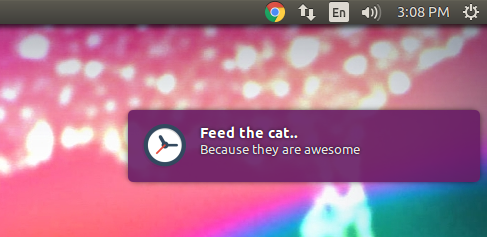

# periodic-notifier
A CLI to notify you something periodically

[]()
[](https://github.com/prettier/prettier)
[]()
[](https://github.com/vajahath/generator-ts-np)

<br>


## Install
```
npm i -g periodic-notifier
```



## Usage
To know usage, try running
```
periodic-notifier --help
```
will give you a quick guide.
```
Usage: periodic-notifier [options]


  Options:

    -V, --version           output the version number
    -I --interval <time>    Interval at which the notification should be fired. To know more about time formats see docs.
    -T --title [title]      Title of the message
    -M --message <message>  Actual message
    -C --icon <icon>        absolute path to icon.png
    -S --sound              set this flag to make sound
    -W --wait               set this flag to wait the notification
    -h, --help              output usage information
```
### Possible `<time>` formats
Following are the values you can use with `-I` or `--interval` option:
- '2 days'
- '1d'
- '10h'
- '2.5 hrs'
- '2h'
- '1m'
- '5s'
- '1y'
- '100' (milliseconds)

## Examples
```
periodic-notifier -I 5s -T "Feed the cat" -M "Because they are awesome.." -W
```

## Change log
- v1.1.0
  - bug fix with icon
  - works in more node versions
  - better docs
- v1.0.0
  - initial release


[](https://github.com/vajahath/generator-ts-np)

## Licence
MIT &copy; [Vajahath Ahmed](https://twitter.com/vajahath7)
